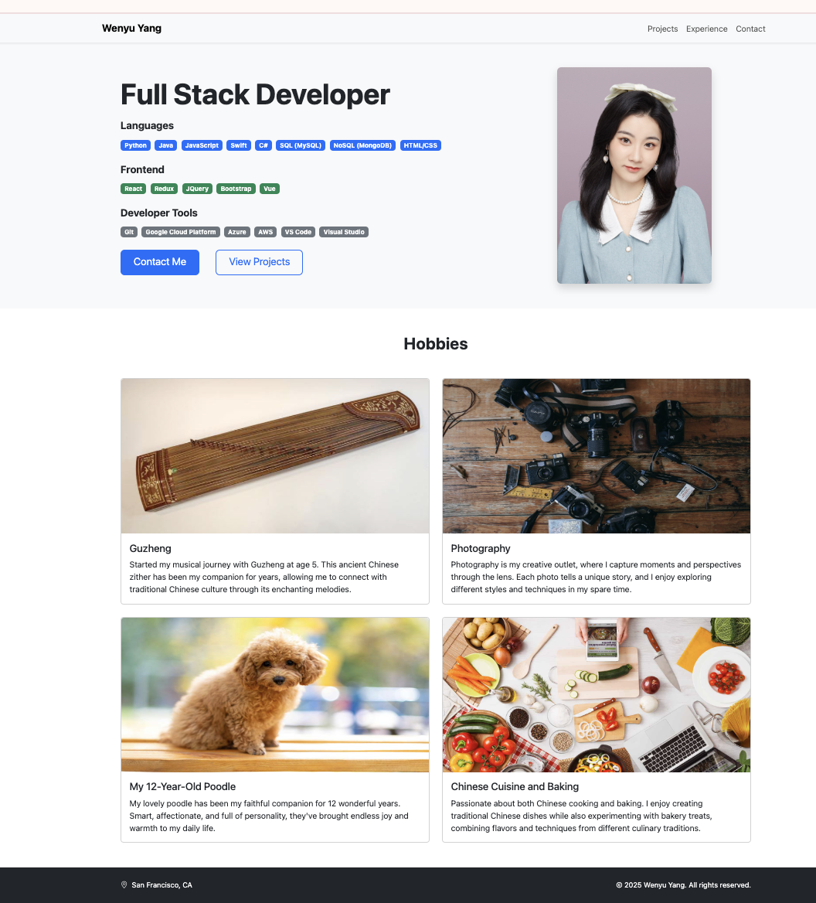
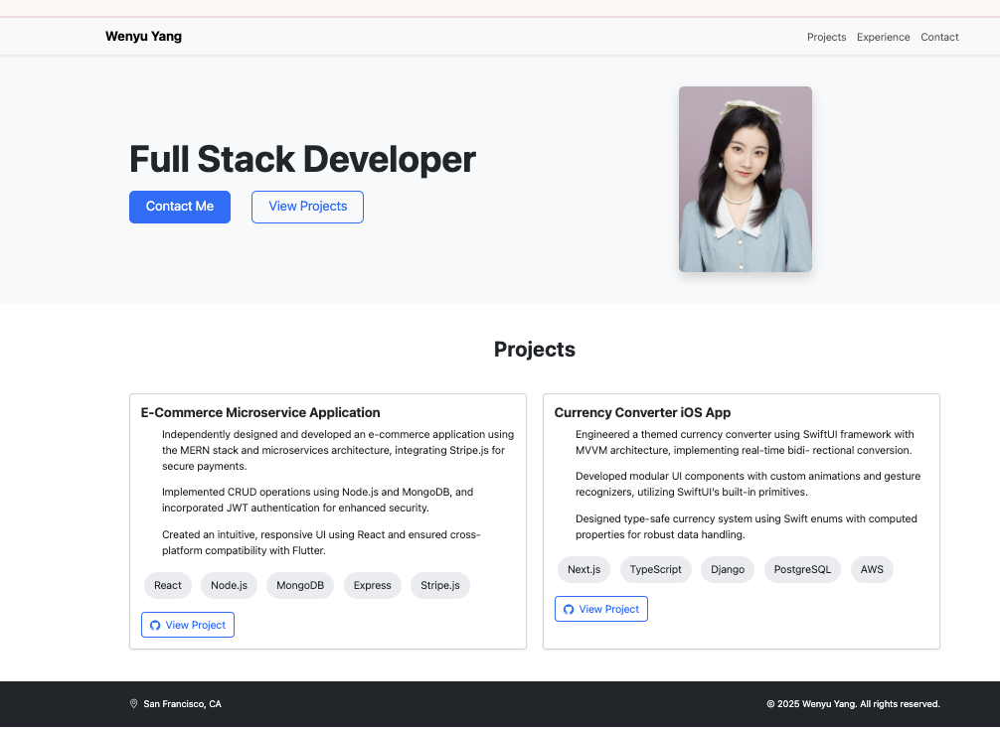
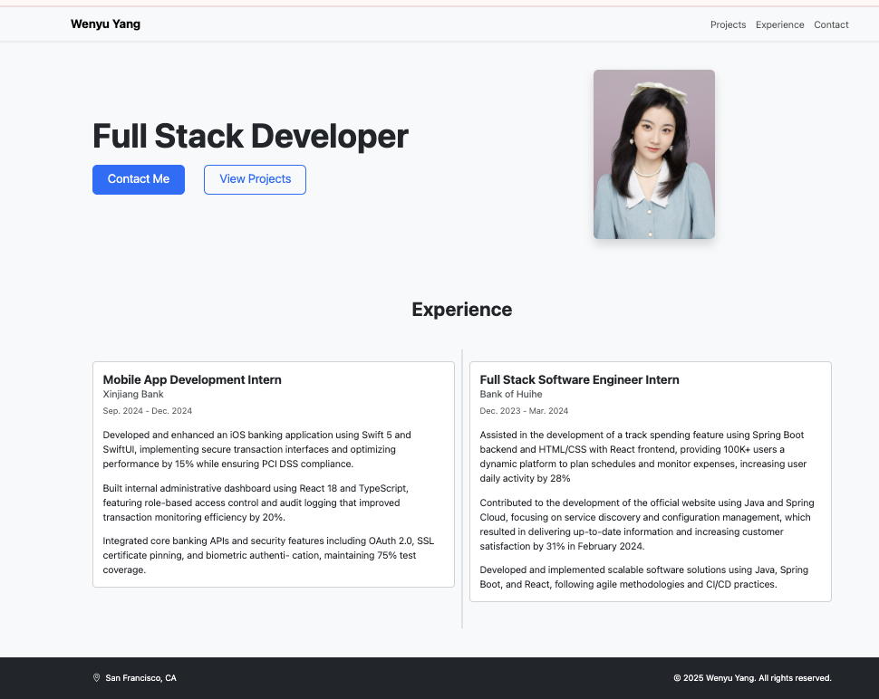
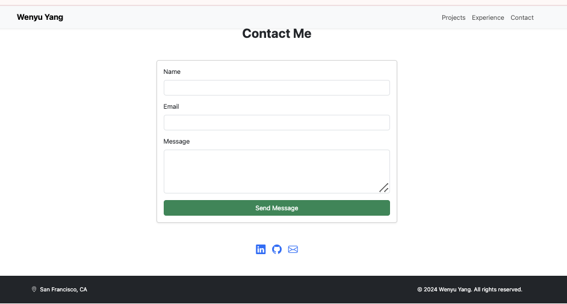

# Personal Portfolio Website

## Author

Wenyu Yang

- GitHub: [Jocelynmie](https://github.com/Jocelynmie)
- LinkedIn: [Wenyu "Jocelyn" Y.](https://www.linkedin.com/in/wenyu-jocelyn-y-62833a219/)
- Email: jocelynmiemie@gmail.com

## Class Link

[Your class link here]

## Project Objective

A responsive personal portfolio website showcasing my professional experience, projects, and technical skills as a Full Stack Developer. The website features a clean, modern design with sections for projects, work experience, and contact information.

## Key Features

- Responsive navigation with Bootstrap
- Interactive contact form
- Project showcase with GitHub links
- Skills display with categorized badges
- Professional experience timeline
- Personal interests/hobbies section
- Social media integration

## Technologies Used

- HTML5
- CSS3
- JavaScript
- Bootstrap 5.3.2
- Bootstrap Icons

# Build Instructions

1. Clone the repository:

   git clone https://github.com/Jocelynmie/Personal-Home-Page

2. Navigate to the project directory:

   cd Personal-Home-Page

3. Project Structure:

   root/
   ├── index.html # Home page
   ├── projects.html # Projects page
   ├── experience.html # Experience page
   ├── contact.html # Contact page
   ├── css/ # CSS files
   ├── js/ # JavaScript files
   ├── images/ # Image assets
   └── screenshots/ # Project screenshots

4. Dependencies:

   - Bootstrap 5.3.2
   - Bootstrap Icons 1.11.1

5. Access the website:
   - Local development: `http://localhost:8000`
   - Live site: https://jocelynmie.github.io/Personal-Home-Page/

# Screenshots

## Home Page

## Projects Page

## Experience Page

## Contact Page

# What I'm Most Proud Of

- Learned how to use HTML and CSS to build my first websiteuccessfully made my website work with Bootstrap
- Added JavaScript to make the contact form work
- Made links to my GitHub projects that show my coding skills

# Most Challenging Parts

- Understanding how to use Bootstrap for the first time
- Making the navigation menu work on mobile phones
- Getting the contact form to send emails correctly
- Learning how to connect all my social media links
